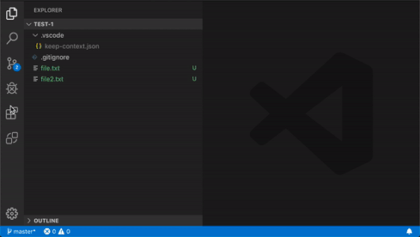

# VS Code - Keep Context

	
   
   
  
  

This extension was created to help those that at some point need to do some context switch and some times more often than we would like.
With this extension you won't forget the files that you need to open to continue working in that task.

## Features

### Task management

In a simple way you can create tasks an track the opened files without get lost when switching context.

## Known Issues

We are just starting but we know that we will have issues, to avoid duplicated issues they will be here :beetle:

## Release Notes

The release notes can be seen in [CHANGELOG.md](./CHANGELOG.md)
