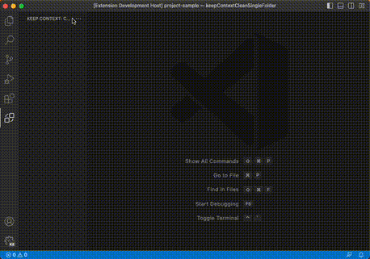

# VS Code - Keep Context

This extension was created to help those that at some point need to do some context switch and some times more often than we would like.
With this extension you won't forget the files that you need to open to continue working in that task.

## Features

### Task management

In a simple way you can:

- Create/edit/delete task
- Track opened files by task
- Track git branch by task

## Keybindings

- `Ctrl+K Ctrl+Shift+C` (`Cmd` instead of `Ctrl` for MacOS) to create a task.
- `Ctrl+K Ctrl+Shift+S` (`Cmd` instead of `Ctrl` for MacOS) to select an task to be activated.

## Limitations

- It may work in workspaces with more than one folder, but it only supports single folders.
- It doesn't store `TabInputTextDiff`, `TabInputWebview`, `TabInputNotebookDiff`, and `TabInputTerminal`.
- Preview tabs are not stored.
- We don't have a listener for "tab group resize", it relies on tab group change to update that currently.

## Known Issues

We are just starting but we know that we will have issues, to avoid duplicated issues they will be here :beetle:

## Release Notes

The release notes can be seen in [CHANGELOG.md](CHANGELOG.md)
